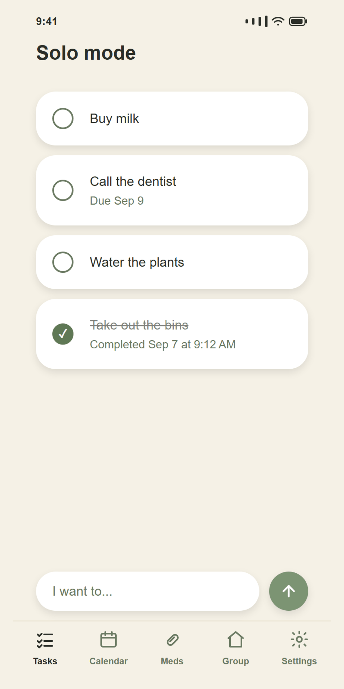
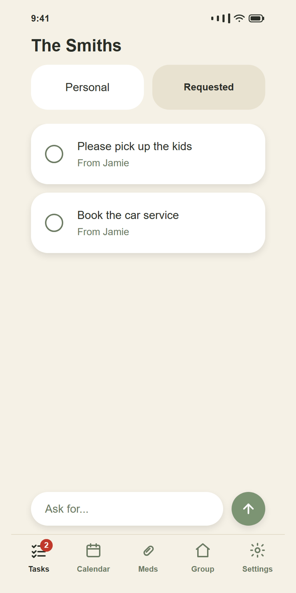
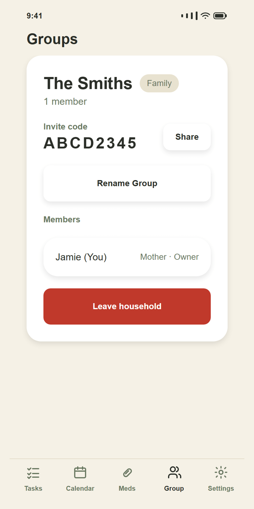
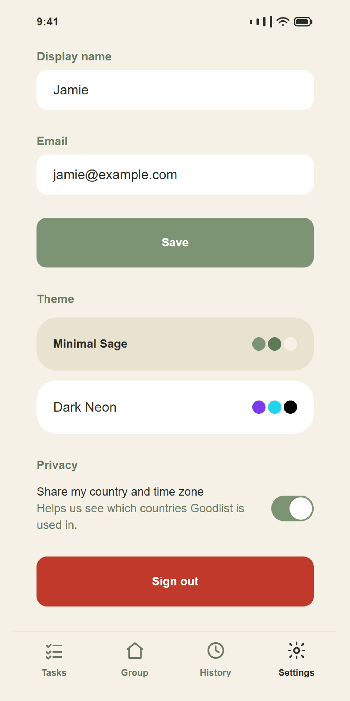

# Goodlist

A cross-platform task app for your own to-dos and for sharing tasks with a small group — family or
team. Built with [Expo](https://expo.dev) + [Expo Router](https://docs.expo.dev/router/introduction)
and a realtime [Supabase](https://supabase.com) backend.

<p align="center">
  
  
  
  
</p>
<p align="center">
  <sub>Your own list · What your group asked of you · Invite code · Nine themes</sub>
</p>

## Using the app

New to Goodlist, or handing it to someone who is? There's a plain-language, picture-by-picture
walkthrough — making an account, adding your first task, and going from solo to a shared family or
team group. No technical knowledge assumed. It's in three places, all rendered from the same
`src/content/guide.ts`, so they can't drift apart:

- **In the app** — Settings → Help → *How to use Goodlist*. Screenshots are bundled, so it works
  with no connection: someone who is stuck and offline is exactly who needs it.
- **On the web** — <https://jericrealubit.github.io/goodlist/guide/>, for sending to someone who
  doesn't use GitHub.
- **On GitHub** — [docs/user-guide](docs/user-guide/) renders the same walkthrough as Markdown.

## Features

- **Personal tasks** — a to-do list that's yours alone: add, edit, complete, reopen, delete, add notes
  and due dates, and drag to reorder.
- **Groups** — create or join up to two groups per account, in Family mode (roles: father, mother,
  guardian, child, other) or Team mode (roles: leader, member). Join with an invite code; the owner can
  rename the group, remove members, or transfer ownership.
- **Requested tasks** — ask a group member to do something and track it until it's done. The requester
  can cancel an open request; the assignee can mark it complete or reopen it. Either side can jump
  straight from the task to its group.
- **History** — every completed or cancelled task, timestamped with when it was finished, with one-tap
  undo and delete (individually or all at once).
- **Notifications** — an in-app unread badge that updates live (via Supabase Realtime) whenever someone
  requests a task from you.
- **Realtime sync** — task and notification changes made by any group member appear immediately on
  everyone else's device.
- **Offline-first** — the app works without a connection: reads come from a persisted local cache
  (`@tanstack/react-query` + AsyncStorage), and queued writes replay automatically once you're back
  online. An offline banner shows connection and sync status.
- **Appearance** — nine built-in color themes, each with light/dark variants.
- **Community stats** — an anonymous, aggregate view of how many accounts exist, how many are active
  right now, and how many people use Goodlist solo vs. in a group. An admin-only screen additionally
  breaks this down by country/region, derived from device time zone (never GPS or IP).
- **Account & privacy controls** — edit your display name, toggle whether your country/time zone is
  counted in community stats, and permanently delete your account (blocked while you still own a group
  with other members in it, to protect them).
- **Built-in guide** — an illustrated, 15-step walkthrough under Settings → Help, bundled with the
  app so it works offline. Its copy lives once in `src/content/guide.ts` and also renders as a
  public web page (`npm run guide:site`).
- **Legal** — in-app About, Privacy Policy, and Terms of Service screens (`src/app/(app)/about.tsx`,
  `privacy.tsx`, `terms.tsx`). The policy text lives once in `src/content/legal.ts`; the in-app
  screens and the public pages Google Play links to (`npm run legal:site` → `docs/legal/`) both
  render from it, so they can't drift apart.

## Tech stack

React Native · Expo · Expo Router · TypeScript · Supabase (Postgres, Auth, Realtime, RLS) ·
TanStack Query (with an AsyncStorage persister for offline/local-first caching) · Reanimated ·
`react-native-sortables` (drag-to-reorder) · `react-native-gesture-handler` (swipe actions).

## Project structure

```
src/
  app/            Expo Router screens (file-based routing)
    (auth)/        Sign in, sign up, forgot/reset password
    (app)/
      (tabs)/       Tasks, Group, History, Settings
      group/        Create / join a group
      task/[id]     Task detail / edit
      about, guide, privacy, terms, stats, distribution
  components/     Shared UI (TaskRow, ComposeBar, GroupCard, legal-document,
                  guide-document, ...)
  hooks/          Data-fetching and mutation hooks (React Query)
  lib/            Supabase client, queries, mutations, types, validation
  constants/      Theme definitions, group role/mode options
  content/        legal.ts, guide.ts — copy shared by the in-app screens and the
                  published web pages, as plain data with no React imports
assets/
  images/guide/   Guide screenshots bundled into the app (npm run guide:screens)
docs/
  index.html      The published site, built by `npm run site` and served by GitHub
  guide/          Pages from main /docs at https://jericrealubit.github.io/goodlist/
  legal/
  user-guide/     The same walkthrough as Markdown, for reading on GitHub
  screenshots/    Callout-free product shots used by this README
scripts/
  lib/            site-shell.mjs (shared site chrome), distribution-report.mjs
supabase/
  schema.sql      Full database schema, RLS policies, and RPC functions —
                  hand-applied via the Supabase SQL editor (no migrations/CLI linkage in this repo)
```

## Get started

1. Install dependencies:

   ```bash
   npm install
   ```

2. Create a `.env.local` with your Supabase project's public keys:

   ```
   EXPO_PUBLIC_SUPABASE_URL=https://<your-project>.supabase.co
   EXPO_PUBLIC_SUPABASE_ANON_KEY=<your-anon-key>
   ```

   Then set up the database by running `supabase/schema.sql` once in that project's SQL editor.

3. Start the app:

   ```bash
   npm start
   ```

   From there, open it on an Android emulator/device (`npm run android`), iOS simulator/device
   (`npm run ios`), the web (`npm run web`), or scan the QR code with
   [Expo Go](https://expo.dev/go).

## Scripts

| Script | Purpose |
| --- | --- |
| `npm start` | Start the Metro/Expo dev server |
| `npm run android` / `ios` / `web` | Start the dev server targeting a specific platform |
| `npm run lint` | Run `expo lint` |
| `npm run reset-project` | Move the starter code aside and scaffold a blank `app/` directory |
| `npm run report:distribution` | Generate a user-distribution report from Supabase data (admin tooling) |
| `npm run guide:screens` | Re-render the guide screenshots — `docs/user-guide/images/`, the copies bundled into the app, and this README's product shots |
| `npm run site` | Build the whole published site into `docs/` (index + legal + guide) |
| `npm run index:site` / `legal:site` / `guide:site` | Build one section of that site on its own |

## Deployment

Builds are produced with [EAS Build](https://docs.expo.dev/build/introduction/) (`eas.json` defines
`development`, `preview`, and `production` profiles). For example:

```bash
npx eas-cli build --platform android --profile preview
```

`preview` produces a directly installable APK; `production` produces a Play Store-ready `.aab` with an
auto-incrementing version code. There is no OTA/EAS Update channel configured yet — JS changes require a
new build to reach devices outside of Expo Go.

For Google Play specifically, three docs split the work:

| Doc | Holds |
| --- | --- |
| [docs/play-store-deployment.md](docs/play-store-deployment.md) | The step-by-step runbook — the account and closed-testing gates that set the timeline, the repo changes needed before the first build, and the order to do everything in |
| [docs/play-store-testing.md](docs/play-store-testing.md) | The internal- and closed-testing tracks in detail — which track counts toward the 12-testers/14-days rule, the tester opt-in mechanics, shipping updates to each track, and troubleshooting |
| [docs/play-store-listing.md](docs/play-store-listing.md) | The listing copy and the Data Safety answers |

### The published site

`docs/` is served by GitHub Pages (Settings → Pages → `main` `/docs`) at
<https://jericrealubit.github.io/goodlist/>:

| Page | Used for |
| --- | --- |
| [`/guide/`](https://jericrealubit.github.io/goodlist/guide/) | The user guide — the Play listing's Website / Support URL |
| [`/legal/privacy/`](https://jericrealubit.github.io/goodlist/legal/privacy/) | Required by Google Play, and linked from the Data Safety form |
| [`/legal/terms/`](https://jericrealubit.github.io/goodlist/legal/terms/) | Terms of Service |
| [`/legal/delete-account/`](https://jericrealubit.github.io/goodlist/legal/delete-account/) | Required: deleting an account without installing the app |

Every page is generated — `npm run site` — from the same `src/content/` modules the in-app screens
render from, so the text Google reviews and the text the app ships are the same by construction.
Re-run it after editing anything in `src/content/`, and commit the regenerated `docs/`.
