# Goodlist — the very simple guide

This guide shows you how to use Goodlist, one small step at a time.

You do **not** need to know anything about phones or apps. Every step has a picture.
The **red dotted box** in each picture shows you exactly where to tap.

**What is Goodlist?** It is a list of things you want to do. You tick things off when
they are done. Later, if you want, you can add other people — your family or your team —
and ask them to do things too.

---

## What's in this guide

**Part 1 — Just you** (start here)

1. [Make your account](#step-1--make-your-account)
2. [Log in](#step-2--log-in)
3. [Add your first thing to do](#step-3--add-your-first-thing-to-do)
4. [Look at your list](#step-4--look-at-your-list)
5. [Tick something off](#step-5--tick-something-off)
6. [Change a task](#step-6--change-a-task)
7. [Find things you finished](#step-7--find-things-you-finished)

**Part 2 — You and other people**

8. [Open the Group page](#step-8--open-the-group-page)
9. [Make your group](#step-9--make-your-group)
10. [Give out your code](#step-10--give-out-your-code)
11. [They type in the code](#step-11--they-type-in-the-code)
12. [They pick who they are](#step-12--they-pick-who-they-are)
13. [Your list now has two parts](#step-13--your-list-now-has-two-parts)
14. [Ask someone to do something](#step-14--ask-someone-to-do-something)
15. [What they see](#step-15--what-they-see)

**Also useful**

- [The four buttons at the bottom](#the-four-buttons-at-the-bottom)
- [Small things that are nice to know](#small-things-that-are-nice-to-know)
- [If something goes wrong](#if-something-goes-wrong)
- [Words we used](#words-we-used)

---

## The four buttons at the bottom

Look at the very bottom of the app. There are four buttons. They never change.

| Button | What it is for |
| --- | --- |
| **Tasks** | Your list of things to do. This is the main page. |
| **Group** | The people you share with. Empty at first — that is fine. |
| **History** | Everything you have already finished. |
| **Settings** | Your name, the colours, and signing out. |

Tap one and the page changes. That's all they do. You cannot break anything by tapping them.

---

# Part 1 — Just you

You do not need anybody else to use Goodlist. It works perfectly well on your own.

## Step 1 — Make your account

Open Goodlist. The first thing it asks is who you are.

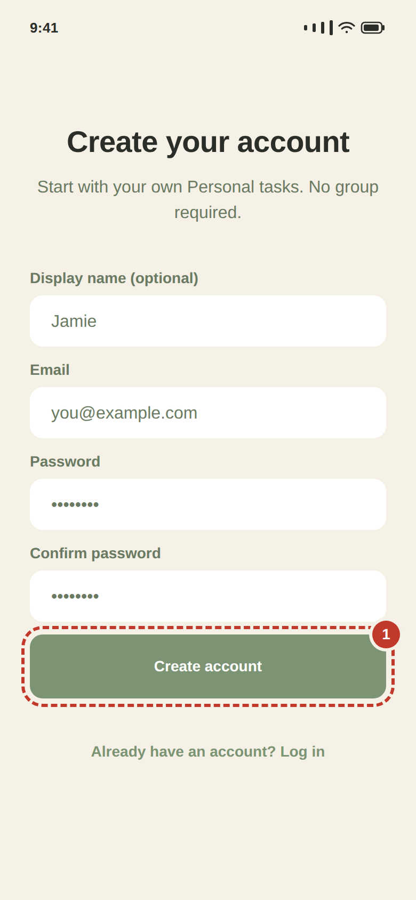

1. Type your **name** in the first box. (You can skip this one.)
2. Type your **email** in the second box.
3. Make up a **password** and type it twice, so the app knows you didn't mistype it.
   It has to be **6 letters or numbers or more**.
4. Tap **Create account**.

> **If it says "Check your email"** — go to your email, open the message from Goodlist,
> and tap the link inside. Then come back to the app.

## Step 2 — Log in

Already made an account? Then this is the screen you'll see.

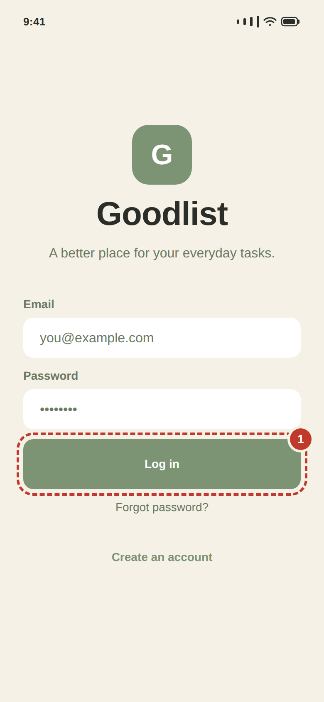

1. Type your **email** and **password**.
2. Tap **Log in**.

You only have to do this once. The app remembers you afterwards.

> **Forgot your password?** Tap **Forgot password?** just under the button.
> Goodlist emails you a link to make a new one.

## Step 3 — Add your first thing to do

Now you're in. The page says **Solo mode** at the top. "Solo" just means *on your own*.

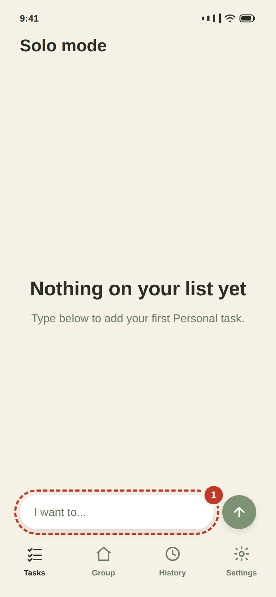

The list is empty. That's normal — you haven't put anything in it yet.

At the bottom there is a long white box that says **I want to...**

1. Tap that box. The keyboard comes up.
2. Type the thing you want to do. Anything at all. `Buy milk`.
3. Tap the **round green arrow** next to the box.

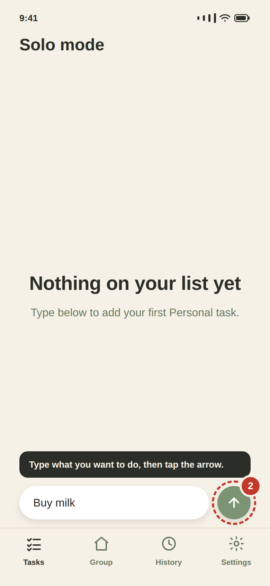

That's it. Your task is on the list.

The box empties itself so you can type the next one straight away. Add as many as you like.

## Step 4 — Look at your list

Every task sits on its own little white card.

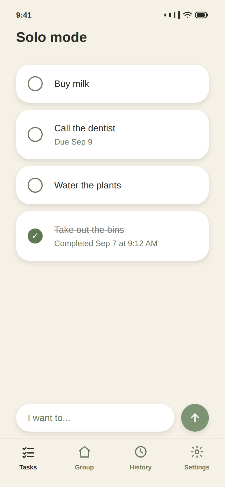

- The **empty circle** on the left means *not done yet*.
- Small grey writing under a task tells you extra things, like **Due Sep 9**.
- A task with a line through it is one you already finished.

**To move a task up or down:** press your finger on it, hold, and slide it where you want.
Let go. Put the important ones at the top.

## Step 5 — Tick something off

This is the best part.

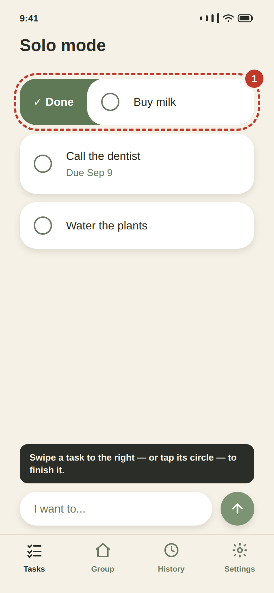

There are **two** ways to finish a task. Both do exactly the same thing:

- **Tap the circle** on the left of the task, or
- **Slide the task to the right** with your finger. A green **✓ Done** appears behind it.

The circle fills in green, and a line goes through the words.

> **Ticked the wrong one?** Tap the circle again. It comes straight back.

## Step 6 — Change a task

Tap the **words** of a task (not the circle) to open it.

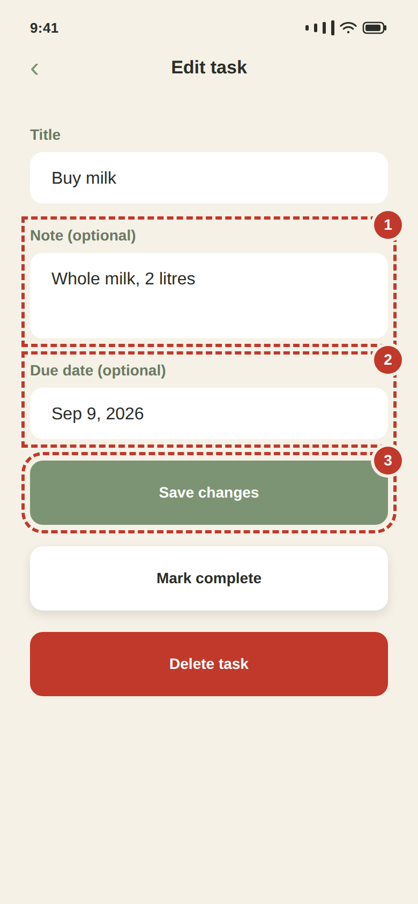

Here you can:

1. Add a **Note** — anything extra you want to remember. `Whole milk, 2 litres`.
2. Add a **Due date** — the day it needs doing by.
3. Tap **Save changes** when you're happy.

The other two buttons:

- **Mark complete** — same as ticking the circle.
- **Delete task** — throws it away completely. This one cannot be undone, so it is red.

Don't want to change anything? Tap the **‹** arrow at the top left. Nothing is saved.

## Step 7 — Find things you finished

Tap **History** at the bottom.

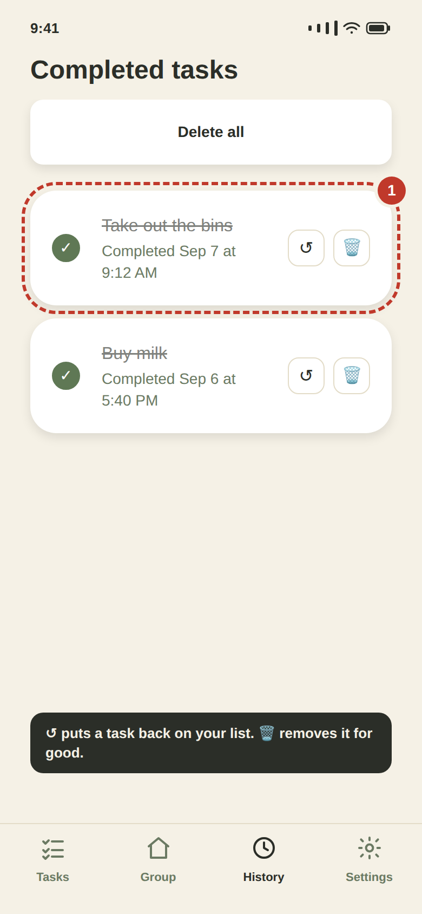

Everything you have ever finished lives here, newest first, with the day and time you did it.

Next to each one:

- **↺** puts it back on your to-do list. Changed your mind, or ticked it too early.
- **🗑** removes it forever.

**Delete all** at the top empties the whole history in one go. It asks you first, because
this cannot be undone.

---

# Part 2 — You and other people

Everything above still works exactly the same. This part just **adds** to it.

A **group** is a small set of people — your family, or a small team at work. Once you're in
one, you can ask each other to do things.

> **Important:** the tasks you already made stay **private**. Nobody else in the group can
> see your own list, ever. The only things anybody else sees are the ones you specifically
> ask them to do.

## Step 8 — Open the Group page

Tap **Group** at the bottom of the screen.

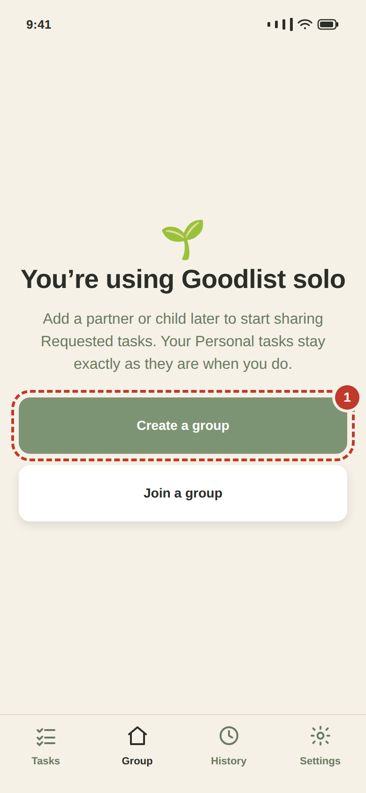

There are two buttons, and you only need one of them:

- **Create a group** — you are the first one. Pick this if you're setting it up.
- **Join a group** — somebody has already made one and given you a code.

This guide shows **Create a group** first, then what the other person does.

## Step 9 — Make your group

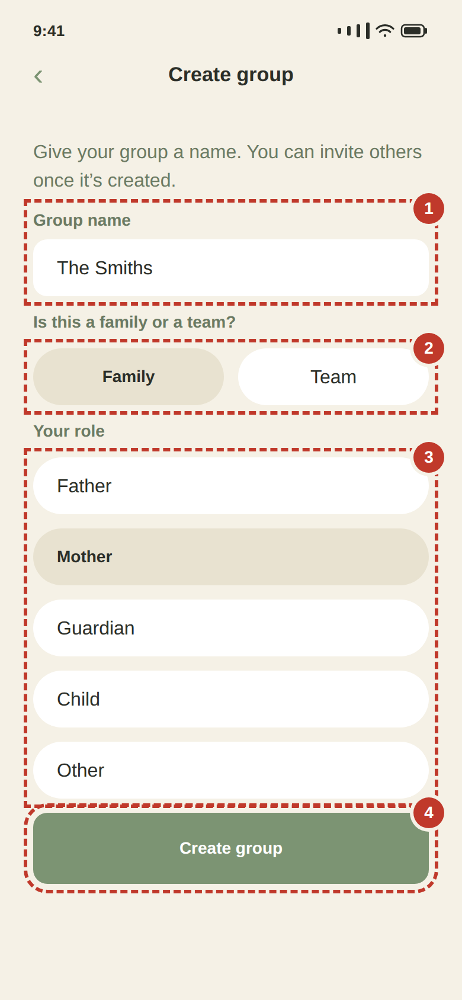

1. **Give it a name.** Anything you'll recognise. `The Smiths`.
2. **Family or Team?** Pick one. It only changes the words in the next list.
3. **Your role.** Who are you in this group?
   - A **Family** offers: Father, Mother, Guardian, Child, Other.
   - A **Team** offers: Leader, Member.
4. Tap **Create group**.

Done. The group exists, and right now you are the only one in it.

## Step 10 — Give out your code

Your group now has a card with a **code** on it — eight letters and numbers.

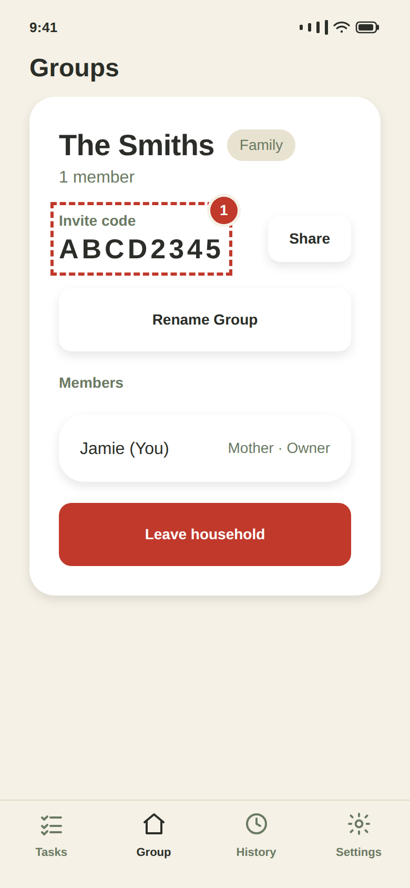

This code is how somebody joins. Nobody can get in without it.

Tap **Share** to send it by message, email, or whatever you normally use.
Or just read it out loud — that works too.

> The code never uses a **zero**, an **O**, a **one**, or an **I**. That's on purpose,
> so nobody mixes them up.

## Step 11 — They type in the code

**The next two steps happen on the other person's phone, not yours.**

They install Goodlist, make their own account (Step 1), and tap **Group** → **Join a group**.

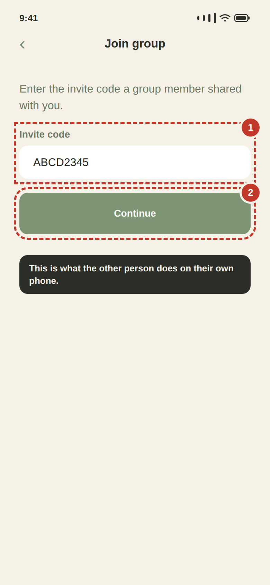

1. They type the code you gave them.
2. They tap **Continue**.

## Step 12 — They pick who they are

The app shows them the group name so they know it's the right one.

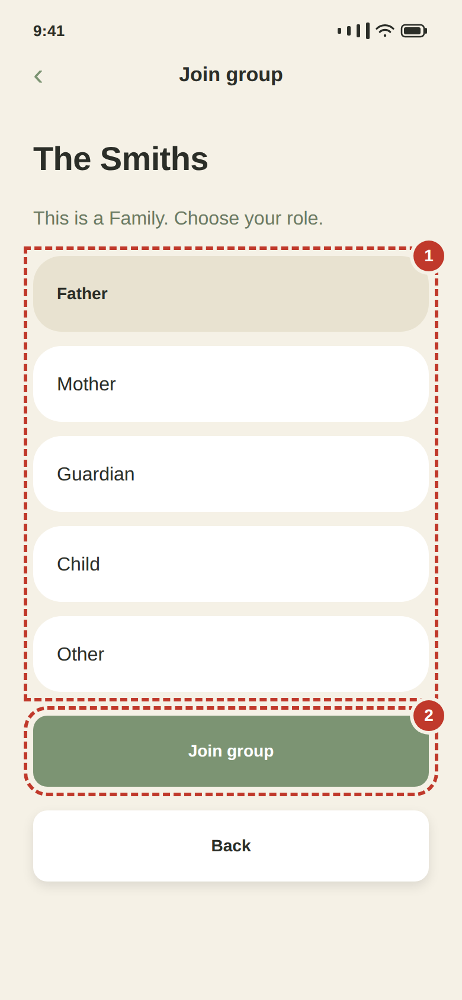

1. They pick **their** role — Father, Mother, Child, and so on.
2. They tap **Join group**.

That's it. You're now in a group together. Both of you will see the other person's name
on the Group page.

## Step 13 — Your list now has two parts

Go back to **Tasks**. Something has changed: there are two words at the top now.

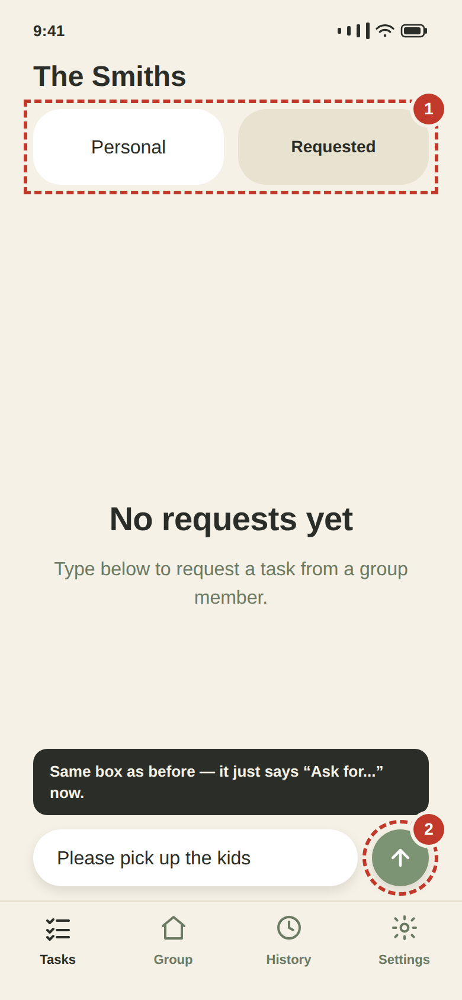

- **Personal** — your own list. Exactly as before. Still private, still only yours.
- **Requested** — things you and your group have asked *each other* to do.

The name at the very top has changed too. Instead of **Solo mode** it now shows your
group's name.

## Step 14 — Ask someone to do something

Tap **Requested**, then use the same typing box as always.

1. Type what you'd like them to do. `Please pick up the kids`.
2. Tap the green arrow.

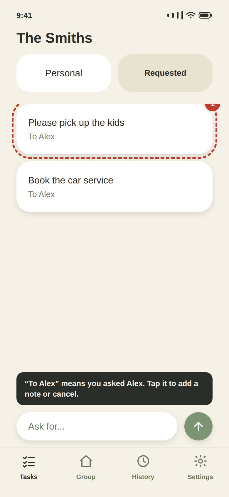

Your request appears with **To Alex** under it — that's who you asked.

> **If your group has more than one other person**, a row of names appears just above the
> typing box. Tap a name first, then type. That's how the app knows who you mean.

Tap the task to add a note or a due date, just like before. If you change your mind, open
it and tap **Cancel request**.

## Step 15 — What they see

On the other person's phone, the same task looks like this:

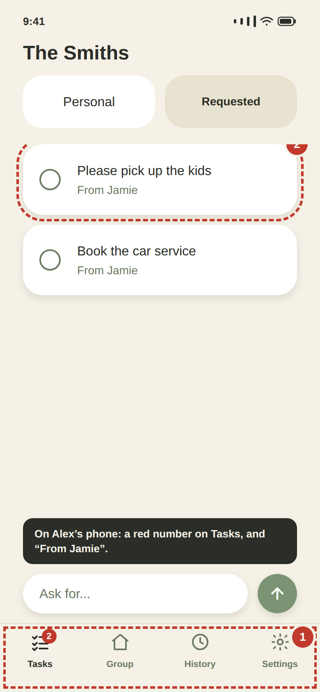

- A **red number** appears on the **Tasks** button. That's how many new requests they have.
  It disappears once they look.
- The task says **From Jamie** — so they know who asked.
- They tick the circle when it's done.

The moment they tick it, it disappears from your Requested list and lands in **History**
for both of you. You don't have to refresh anything. It just happens.

---

## Small things that are nice to know

**Change your name or the colours.** Tap **Settings**.

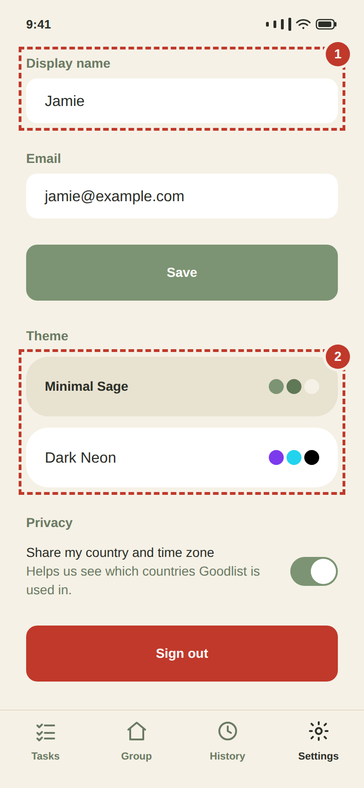

- **Display name** is what other people in your group see. Change it and tap **Save**.
- **Theme** changes all the colours. There are nine to try. Nothing else changes —
  pick whichever one you like looking at.
- The **privacy switch** decides whether your country counts towards the "where is Goodlist
  used" numbers. It uses your phone's time zone — never your actual location, ever.
  Turn it off if you'd rather not.

**No internet? Keep going.** Goodlist works with no signal at all. Add tasks, tick them off,
do whatever you like. A small message appears saying you're offline. When your signal comes
back, everything you did is saved automatically. You don't have to do anything.

**Two groups, no more.** You can be in a family group *and* a work team — but that's the
limit. Two.

**Who can delete what.** Only the person who *made* a task can delete it. If somebody asked
you to do something, you can finish it or un-finish it, but you can't throw it away — it's
theirs.

**Who is in charge of a group.** Whoever made it. That person (the *owner*) can rename the
group, remove somebody, or hand the job to someone else with **Make owner**. Everybody else
can just leave whenever they want.

---

## If something goes wrong

**"Invalid invite code."**
Check every character. Try typing it again slowly. Remember there is never a zero or the
letter O in a code. If it still won't work, ask for a fresh copy — you may have an old one.

**I tapped the circle by accident.**
Tap it again. It comes straight back. If you already left the page, go to **History**
and tap **↺**.

**I can't see my friend's tasks.**
That's correct — you're not meant to. Personal lists are private. You only ever see the
things somebody has specifically asked *you* to do.

**The Requested tab isn't there.**
It only shows up once you're in a group. Go to **Group** and create or join one.

**I can't delete my account.**
If you own a group that still has other people in it, Goodlist stops you — otherwise
you'd take their group away with you. Either give the group to somebody else
(**Make owner**), or remove the other members first. Then you can delete.

**It says "You're offline".**
Nothing is wrong. Carry on using it. Everything saves once your signal is back.

**I want to start completely fresh.**
**Settings** → **Delete account**. It asks you to confirm, because this erases everything
and cannot be undone.

---

## Words we used

| Word | What it really means |
| --- | --- |
| **Task** | One thing you want to do. |
| **Solo mode** | You're using Goodlist on your own, with no group. |
| **Personal** | Your own private list. Nobody else can see it. |
| **Requested** | Something you asked another person to do, or they asked you. |
| **Group** | Your family or your small team, inside the app. |
| **Invite code** | The eight characters somebody needs to join your group. |
| **Owner** | The person who made the group and looks after it. |
| **Role** | Who you are in the group — Mother, Child, Leader, and so on. |
| **History** | The list of everything you've already finished. |
| **Theme** | The set of colours the app uses. |

---

The pictures in this guide are drawn from the app's real screens, colours, and wording,
and are rebuilt with `node ./scripts/generate-guide-screens.mjs`. If a screen changes in the
code, update that script and re-run it so the pictures keep telling the truth.
